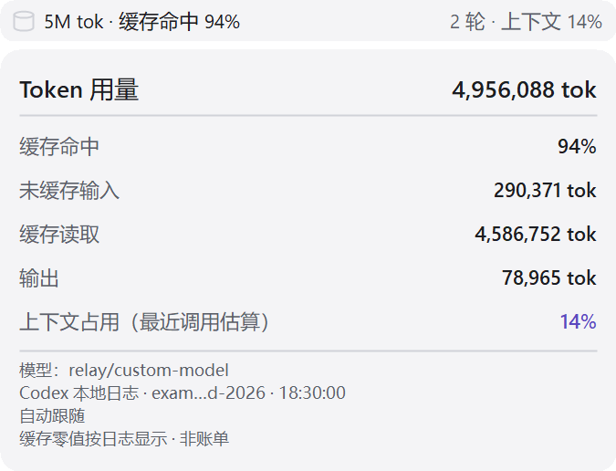

# CodexRelayUsage

适用于 API 中转站模型的 Windows Codex 会话用量悬浮工具，直接读取 Codex 本地会话日志，无需中转站密钥。

悬浮条默认放在顶部“文件／编辑／视图／帮助”右边的空白区，避开输入框、菜单和窗口按钮。点击向下展开 Token 总数、缓存命中率、缓存读取、未缓存输入和输出；支持当前会话跟随、手动锁定、主题和位置调整。

1.0.2 修复快速切换停留在旧对话的问题：识别实际显示页面，切换后清空旧统计并取消旧读取，最近会话保留增量进度。同名对话无法唯一匹配时需手动锁定；不把后台订阅当成当前页面。

- [下载 Windows x64 独立版](https://github.com/14866312/codex-relay-usage/releases/latest)：解压后运行 CodexRelayUsage.exe，自带 .NET 10 运行时。
- [中文使用说明和构建步骤](README.zh-CN.md)
- [版本变更](CHANGELOG.md) · [验证记录](ACCEPTANCE.zh-CN.md)

用量以 Codex 日志中记录的 usage 为准，累计快照不叠加；不自动合并子代理，也不作为中转站账单。上游缺失或被归一化的 usage 无法从本地日志还原。

由 [codex-token-overlay](https://github.com/soleillevant0125/codex-token-overlay) 的 MIT 代码衍生，保留原作者版权；基线和修改范围见 [UPSTREAM.md](UPSTREAM.md)。
