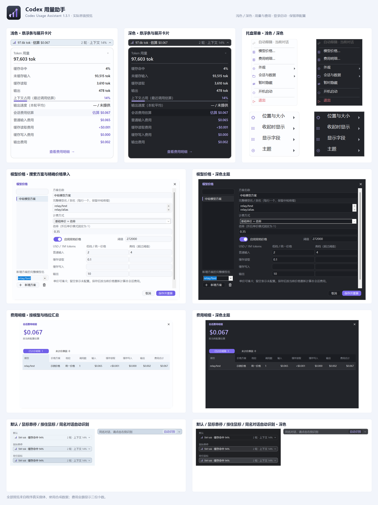
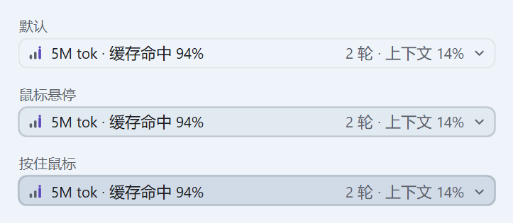
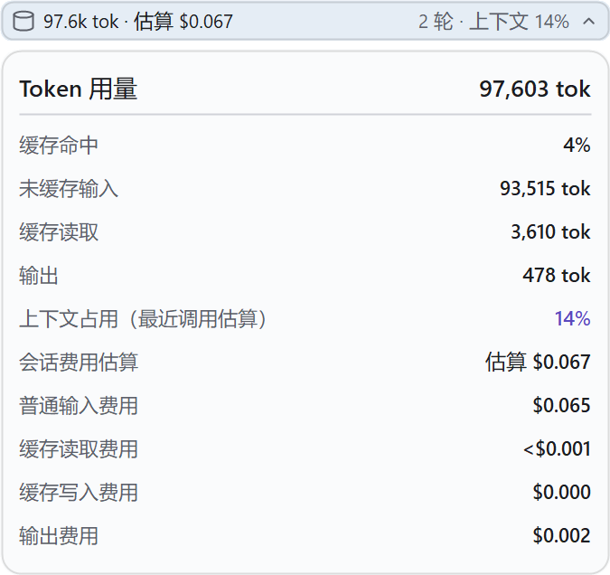
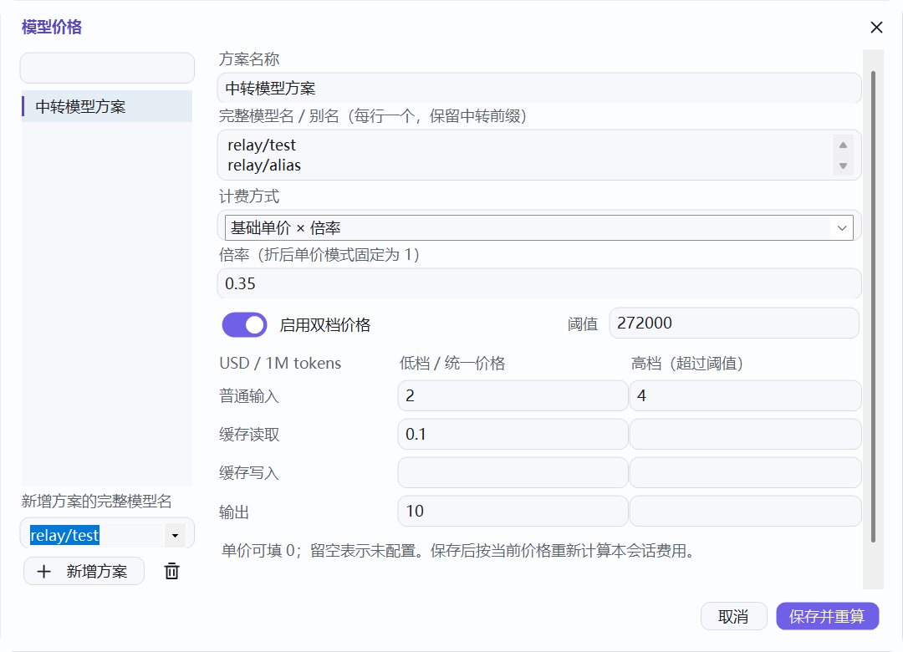
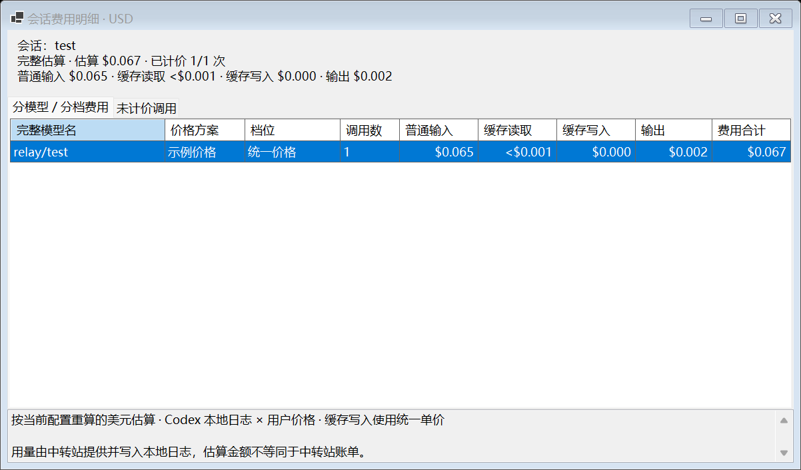

# Codex 用量助手 1.3.1

为使用 API 中转站模型的 Windows Codex Desktop 用户显示当前会话用量。来源始终为 **Codex 本地日志**，无需 API 密钥或 ChatGPT 登录。

收起显示 `5M tok · 缓存命中 94%`，旁边显示已记录轮次与最近调用上下文占用。默认放在顶部“文件／编辑／视图／帮助”右侧的空白区，避开菜单和窗口控制按钮；点击向下展开明细。

沿用浅深色圆角界面：大号 Token 总量、上下文进度条、费用高亮、统一按钮与输入框。卡片右上角可关闭，底部可打开费用明细；模型价格可搜索，费用明细按已计价／未计价分页。

1.3.1 修复“自动识别”点击后仍无法识别的问题。打开目标对话并展开侧栏，点击右侧按钮即可。工具调用 Codex 自带的“复制深度链接”（Ctrl+Alt+L），取得当前页面的唯一会话 ID，随后恢复原剪贴板；若期间又复制了其他内容，则保留新的复制内容。识别中显示“识别中…”并拒绝重复点击；结果按当前侧栏条目记住，返回该条目时自动恢复。切换对话、超时、更换日志目录或退出后，迟到结果不会建立绑定。软件不会重启 Codex，不修改对话内容。

保留“输出速度（本轮平均）”、会话费用与精简界面。若 Codex 的 Ctrl+Alt+L 快捷键被改动或不支持，会明确提示未提供链接；剪贴板无法安全暂存时不会触发复制。Codex 重启或侧栏条目重建后需要重新点击识别。

新名称为“Codex 用量助手”（Codex Usage Assistant）。为兼容旧入口和个人数据，EXE 文件名、配置目录和单实例标识保持不变。价格、位置、主题、字段与缩放设置继续使用。



1.1.4 新增专用启动入口，通过仅监听 127.0.0.1 的本地调试连接读取 Codex 内部页面路由的唯一会话 ID。同项目同名、不同项目同名、标题截断和侧栏隐藏均不影响该识别方式，无需逐个手动绑定。切换路由同时更新会话代次；读取超时或连接断开停止显示旧会话，并自动重连。

1.1.2 在对话进行中随每次调用报告更新 Token 与已知费用，不再等待整轮对话结束。悬浮条标明“进行中”；尚未收到用量时显示“等待调用报告用量”。完整日志行追加后直接通知后台增量读取，并保留轮询补偿。Codex 本地日志没有逐个生成 token 的计数；单次调用尚未报告的用量无法提前得到准确值。

拖动 Codex 时由 Windows 原生窗口事件直接同步悬浮条坐标，移动路径复用已确认的窗口身份、绘制区域与反馈状态，减少拖动时的重绘。拖动期间使用 16ms 补偿检查，普通轮询用于兜底及重新确认主窗口。跨屏 DPI 或窗口尺寸改变时重新计算布局；最小化、恢复、隐藏及切走应用也按窗口事件处理。工具仍为独立窗口，不改动 Codex 的界面文件。

1.1.1 使用贴近 Codex 顶栏的背景、细边框和小圆角，去掉厚重系统阴影。鼠标悬停时约 130ms 平滑变色；按住鼠标立即加深，内容轻微下沉；松开后约 100ms 回弹。展开后保留高亮，箭头约 150ms 翻转，明细约 160ms 向下展开。按住后移到外面松开会取消点击，不会误展开。系统关闭菜单动画或使用高对比度时取消过渡动画，仍保留即时悬停、按下和展开反馈。





预览由实际窗体使用合成示例数据生成，不是你的真实对话数据。previews 目录另有浅色收起、深色展开和深色收起示例。

## 启动与操作

1. 先在托盘退出旧版，解压 CodexRelayUsage-1.3.1-win-x64.zip，进入同名文件夹，运行 CodexRelayUsage.exe。成品自带运行时，无需安装 SDK。同一时间只运行一个实例；当前 Codex 无需关闭。
2. 打开 Codex 主窗口并选择一个对话。初始位置在顶部菜单右侧的空白区；最小化或切到其他应用时隐藏，回到 Codex 时恢复。
3. 如需自定义位置，右击系统托盘“Codex 用量助手”图标，选择“外观 → 位置与大小 → 调整位置和大小…”。拖动悬浮条，拖右下角缩放，按 Enter 或托盘“完成调整”保存，Esc 取消。保存相对窗口的位置，随后跟随窗口移动和缩放；可在该子菜单“重置到顶部菜单空白区”。自动定位保留左侧菜单及右侧最小化、最大化、关闭按钮区域；窗口变窄时先缩小完整悬浮条，再仅显示主指标，空间仍不足时隐藏。
4. 点击 Token 区域向下展开，点击外部收起。正常点击不抢 Codex 输入焦点；位置编辑、会话选择器和托盘菜单属于主动操作。
5. 托盘“外观 → 主题”可选跟随 Windows、浅色或深色；“外观 → 显示字段”控制明细，“外观 → 收起时显示”改变两个主指标。推理 tokens 可选，默认关闭。价格、费用及会话窗口也跟随所选主题；支持标题栏拖动和边缘调整大小。高 DPI 小屏幕下窗口自动限制在可用区域内，价格编辑区滚动，保存按钮保留在底部。
6. “暂时隐藏”不会退出统计进程；“退出”结束程序。托盘图标可能在 Windows 隐藏图标菜单里。

## 开机自动启动与 Codex 入口

在托盘勾选“开机启动”，或双击独立版根目录的“设置开机自动启动.vbs”。设置后，Windows 登录快捷方式直接运行 CodexRelayUsage.exe，工具常驻托盘；没有 Codex 窗口时不显示悬浮条，打开 Codex 后自动显示。启动不经过 .cmd 或常驻 PowerShell 监视器，也不再安装每分钟恢复任务。旧任务和本工具旧监视器会在设置时清理；旧 --watch-codex 参数兼容为直接运行图形程序。菜单每次打开时核对启动入口，已勾选时再次点击取消。

设置还会保留桌面／开始菜单的普通 Codex 快捷方式，携带本地唯一会话识别参数。每次启动动态解析已安装应用路径。已运行的 Codex 不会被关闭或重启，新识别参数在下次正常退出后从该入口打开时生效。也可双击“启动 Codex 自动用量.vbs”。从商店原入口打开时，已经驻留的工具同样显示；无法给该进程补加启动参数，未启用本地调试连接时仍使用兼容识别，同名对话可能有歧义。

Windows 自启动属于当前用户登录启动，不会自动打开 Codex。主动从托盘“退出”后，本次登录期间保持退出，下一次登录或手动运行工具才会恢复。设置后保留独立版目录；移动或升级后从新目录再次设置，以更新快捷方式路径。

取消时取消托盘“开机启动”的勾选，或执行 CodexRelayUsage.exe --remove-startup。取消会恢复已备份的普通 Codex 入口，不关闭 Codex、不删除价格配置。双击入口依赖 Windows Script Host；若系统禁用它，可直接运行 EXE，通过托盘设置。
## 模型价格与会话费用

1. 托盘选择“模型价格…”，在左下方选择日志中出现的完整模型名，或手动输入，再点“新增方案”。上方搜索方案名和模型别名；搜索不会丢弃未保存的有效草稿，无效输入会显示提示并保留。价格首次留空；`0` 是已配置的免费单价，留空是未配置。
2. 选择“基础单价 × 倍率”，录入基础价及倍率，例如 `0.35`；或选择“直接填写折后单价”，录入实际价格，倍率固定为 `1`，不重复打折。四项单价均为 **USD / 1M tokens**，请用小数点填写。
3. 有长上下文价格时保留“双档价格”，分别填低档和高档，阈值默认 `272,000`；无分档时取消勾选，使用低档栏作为统一价。
4. “完整模型名”每行一个别名。按大小写及完整名称精确匹配，保留中转前缀；多个完整别名可以手动绑定同一方案，不能同时绑定不同方案。
5. 点“保存并重算”，后台按当前配置重算所有已识别的历史调用，保留 Token 统计。首次保存方案会启用展开面板中的费用字段；以后可通过“外观 → 显示字段 → 会话费用估算”调整。
6. 托盘“费用明细…”或展开卡片底部“查看费用明细 →”查看分模型、分档的四项费用和合计，“未计价原因”页列出具体缺失原因。要在悬浮条直接显示费用，选“外观 → 收起时显示 → 右侧指标 → 会话费用估算”，例如 `5M tok · 估算 $0.067`。



普通输入是包含缓存的总输入减去缓存读取和缓存写入。每次调用先选档，再计算：

```text
普通输入 = 总输入 − 缓存读取 − 缓存写入
单次费用 = (普通输入 × 输入单价 + 缓存读取 × 读取单价
          + 缓存写入 × 写入单价 + 输出 × 输出单价) ÷ 1,000,000 × 计费倍率
```

**每次调用包含缓存的总输入 ≤272,000 时用低档，超过时整次调用使用高档**，不只对超出部分收费。会话累计输入不会触发高档。阈值可改；关闭分档时始终使用统一价。推理 tokens 已含在输出中，不重复收费；缓存写入首版使用统一单价，不区分缓存时长。

例如普通输入 `93,515`、缓存读取 `3,610`、写入 `0`、输出 `478`，即总输入 `97,125`；输入／读取／输出基础单价 `2 / 0.1 / 10`、倍率 `0.35`，费用为 **$0.06725985**，收起显示 **$0.067**。计算使用 decimal，中间不主动舍入；金额统一显示三位小数，小额正数显示 `<$0.001`。



| 费用状态 | 含义 |
|---|---|
| 完整估算 | 去重后的逐次记录与线程累计量核对一致，所有需要的用量和价格有效。 |
| 已知费用／部分记录 | 只汇总已能计价的调用；其余可能有历史缺口、未知模型、缺失字段、未配置价格或异常记录。全都无法计价时显示 `—`。 |
| 无法逐次计费 | 旧日志只有累计用量，无法恢复各次模型和档位，费用显示 `—`。 |
| 等待调用记录 | 新会话尚未记录用量，金额不显示为零。 |

费用优先读取 `token_usage_record.payload.usage`，按线程、session_id 与 response_id 去重；不同请求即使用量相同也分别计费。仅通过相同 turn_id 的 turn_context 确定调用模型，不猜测最近模型。`thread_token_usage` 及旧累计快照仅核对完整性，不额外计费。负数、溢出、读写之和超过输入、同一请求冲突等列为异常并排除。缺失数量不会默认为零；只有数量明确为零的分项可省略单价。

修改价格、倍率或阈值会按新配置重算历史，费用明细标注“按当前配置估算”。这不是价格变更前的账单快照；用量及费用均以本地日志和用户配置为依据。

## 会话跟随

专用入口用 --remote-debugging-address=127.0.0.1 和 --remote-debugging-port=0 打开已安装的 Codex，端口由系统分配。工具仅发现已确认主窗口进程拥有的 IPv4 回环监听端口，只连接唯一的 app://-/index.html 主页面，排除浏览器、嵌入网页和分离窗口。每 100ms 有界读取 MemoryRouter 的 pathname 和导航 key；不读取对话正文、不修改页面，也不注入持久监听器。

当前本地会话路由 /local/<会话 ID> 直接决定统计对象，不依赖标题、项目或侧栏。路由 ID、导航 key、窗口、进程生命周期和页面目标共同决定代次；切换清空旧 Token／费用并取消过时读取。首页和未知路由清空统计。超时约 650ms 后断开并清空，连接恢复后重新读取当前路由。已有日志读取及费用版本核对继续生效。

首次启用唯一 ID 识别时，在完成当前工作后正常退出 Codex，再使用桌面／开始菜单 Codex 快捷方式或“启动 Codex 自动用量.vbs”。当前 Codex 已运行时，入口只启动工具，不打断任务；下次启动才应用新参数。手动锁定仍可选，若以前主动锁定，请取消锁定恢复自动跟随。

直接启动旧入口而没有调试连接时，保留原可访问性／标题／侧栏识别作为兼容回退，该模式不能保证同名唯一识别。调试连接曾成功建立后，断开不会回退到标题猜测。此版本已验证本机 Codex 26.930.7945.0 的路由结构；未来更新若内部路由改变，会显示不可读取，不承诺跨所有未来版本。远程主机或云对话日志不在首版范围，多个可见主窗口会停止自动识别。

本地调试端口不对外网开放，但同一电脑上可访问该端口的程序具有浏览器调试能力；请只使用可信本机软件。工具自身仅请求页面路由元数据，不读取密钥或中转请求。

## 目录与数据

默认读取 `%USERPROFILE%/.codex/sessions` 及同级 `archived_sessions`；设置了 `CODEX_HOME` 时读取它下面的 sessions。托盘“会话与数据 → 选择 Codex 日志目录…”接受 .codex 根目录或 sessions；会话锁定、选择和绑定也位于“会话与数据”。显式启动参数优先于保存的目录：

```powershell
.\CodexRelayUsage.exe --sessions "D:\CodexHome\sessions"
```

会话发现和首次读取在后台运行，当前文件随后增量读取。文件追加通知直接触发读取，不需要先重新扫描目录；读到一半又收到变化时，在当前读取完成后立刻补读。创建、移动、删除和通知丢失时重扫目录，并保留一秒扫描补偿。未写完的 JSON 行等补齐再处理。同一会话的活动和归档副本去重，只选一个文件。

设置位于 `%LOCALAPPDATA%/CodexRelayUsage/settings.json`，记录位置、60%–130% 缩放、主题、字段、日志目录和锁定 ID。从 1.0.0 升级时首次将旧位置迁移到顶部，保留主题、字段、目录、锁定 ID 和缩放偏好；以后保存的手动位置会继续保留。

价格独立保存在 `%LOCALAPPDATA%\CodexRelayUsage\prices.json`，使用独立配置版本和原子保存。保存失败时保留原文件并提示，界面不切换到未保存价格。1.3.1 保留已有的价格、顶部位置、向下展开、主题、字段和缩放设置。指定 `--settings` 时，测试价格文件位于该设置文件同目录。

程序不读取 API 密钥配置、不改写会话日志、不调用中转接口、不开放 HTTP 服务；读取元数据和 usage 事件，不保存正文副本。不要把真实日志或个人设置加入分享的源码包。

## 数字口径

| 显示项 | 计算和含义 |
|---|---|
| Token 用量 | 优先使用逐次记录的有效 `thread_token_usage`；较旧或上下文压缩后的较小累计快照不会降低该值。没有线程累计时使用可核对的去重调用合计；兼容旧 `total_token_usage`。调用与累计快照是不同视图，绝不相加。总量缺失时仅对完整有效的输入／输出相加。 |
| 缓存读取 | `cached_input_tokens`，已包含在输入中。 |
| 未缓存输入 | 输入减缓存输入；任一字段缺失则无法计算。 |
| 缓存命中 | 缓存输入 ÷ 输入 × 100%，四舍五入到整数百分比；输入为零显示 `—`。 |
| 输出 | `output_tokens`。 |
| 推理输出 | `reasoning_output_tokens`，已含在输出中，不再次加总。 |
| 上下文占用 | 最近调用的逐次用量或 `last_token_usage` 总量 ÷ 日志记录的 `model_context_window`，标明“最近调用估算”，不使用会话累计总量；窗口大小未提供时显示未知。 |
| 轮次 | 当前日志中按 `turn_id` 去重的 `task_started` 数量，是已记录轮次。 |

未知值在明细中显示 `— / 未提供`，明确零值显示 0。负数、缓存大于输入、推理大于输出、溢出、非整数、总量不一致等显示异常提示。无效的已报告总量不会用输入加输出伪装为正常值。模型别名保持原样。

展开面板已移除模型、会话 ID、更新时间和状态页脚；取数来源可通过本机诊断查看。新式线程累计可能包含上下文压缩前的用量，因此升级后累计值可能高于旧版；这不是重复相加。只有部分历史逐次记录而没有线程累计时，不把未知重叠的记录加到旧快照上。

**准确性边界：**中转站可能漏报或改写 usage，Codex 也可能将缺失值归一化为零。日志不能还原上游真实值。“缓存读取 0”表示记录为零，不能证明上游完全未命中。统计不能直接作为中转站账单。

只统计当前线程，不合并子代理；tok/s、执行步数和多窗口对应关系仍不在当前版本范围内。

| 状态 | 处理 |
|---|---|
| 同名对话无法唯一识别 / 项目归属不完整 | 展开侧栏，点击悬浮条右侧“自动识别”。工具从当前页面复制的深度链接读取 ID。 |
| 侧栏项目无法唯一匹配 / 无法识别当前对话 | 检查项目同名与本地标题／项目元数据；不能可靠识别时手动选择并锁定。 |
| 页面读取超时 / 未提供对话链接 | 回到目标对话重试；确认 Codex 的 Ctrl+Alt+L 可以复制深度链接。 |
| 等待当前会话用量 / 进行中 · 等待调用报告用量 | 尚未收到逐次用量或旧累计快照；收到调用报告后自动更新，不必等待整轮结束。 |
| 等待所选会话日志 | 检查目录和所选会话是否在本机有日志。 |
| 看不到悬浮条 | 确认 Codex 在前台、工具未“暂时隐藏”，再重置位置。 |
| 数字和中转账单不同 | 数据来源与计费口径不同，按上述边界核对。 |

## 源码构建与验证

在 Windows 上使用 .NET 10 SDK，已验证 10.0.401。global.json 指定该版本并允许同功能版本的补丁。源码不包含 SDK；无需替换原系统 SDK，可指定本地 dotnet.exe。首次构建可能下载官方 runtime packs。

在源码根目录执行：

```powershell
.\scripts\Publish-Local.ps1 -DotnetPath dotnet
# 或指定 SDK 的绝对路径
.\scripts\Publish-Local.ps1 -DotnetPath "D:\SDK\dotnet\dotnet.exe" -OutputDirectory "D:\Releases"
```

脚本发布 Windows x64 自包含 EXE，验证发布后的程序并生成预览；输出独立 ZIP、源码 ZIP 和 SHA256 到 artifacts 或指定目录。源码包排除 bin/obj、SDK、用户设置和真实日志。

单独验证与校验：

```powershell
.\scripts\Verify.ps1 -ExecutablePath ".\artifacts\CodexRelayUsage-1.3.1-win-x64\CodexRelayUsage.exe"
Get-FileHash ".\artifacts\CodexRelayUsage-1.3.1-win-x64.zip" -Algorithm SHA256
```

Verify 使用合成日志、费用设置窗体和 Windows 原生窗体探针，需要可创建 WinForms 窗口的 Windows 桌面，不依赖 Codex 登录或真实会话。结果含启动迁移、无控制台入口检查，以及 self-test.json、cost-ui.json、feedback-ui.json、live-ui.json、native-result.json、verification.json。工具栏交互探针验证真实鼠标消息、悬停／按下画面、取消点击与动画；实时探针停止普通轮询，用生产控制器验证追加通知，并用屏幕外的合成宿主窗体验证原生移动／可见性事件、区域复用和延迟。不移动你的鼠标；延迟样本不等同于真实 Codex 跨屏拖动的端到端测量。交付检查与待实际操作的验收场景见 `ACCEPTANCE.zh-CN.md`。

只读费用诊断可执行 `CodexRelayUsage.exe --cost-log-probe "D:\private-check.json" "会话完整ID"`，支持附加 `--sessions`。使用内存中的合成价格核对真实账本，仅输出状态、调用数和核对结果，不输出会话 ID、模型名、Token 数量或金额，不修改个人价格。该文件留在本机。

可选的本机会话切换诊断：执行 `CodexRelayUsage.exe --follow-probe "D:\follow-trace.jsonl" 30 --hidden`，运行同一控制器但隐藏测试悬浮条，30 秒后退出，只记录识别状态、会话 ID、代次和统计总量。省略 `--hidden` 时需先退出正常运行的工具以免两个悬浮条重叠。

侧栏只读诊断为 `CodexRelayUsage.exe --view-probe "D:\view-trace.jsonl" 20`，记录主文档标题、当前侧栏行、项目标签、识别结果及读取耗时，最多 100 次。`--sidebar-binding-probe "D:\binding-check.json" "会话完整ID"` 可核对当前页的临时绑定；探针退出即失效，不修改正常运行工具的绑定。这些诊断文件包含个人会话标识及元数据，留在本机，不加入源码或公开发布。

本工具由 `soleillevant0125/codex-token-overlay` 的 MIT 代码衍生，保留原作者版权。基线及修改说明见 `UPSTREAM.md`；.NET / Windows Desktop 许可和第三方说明在 third_party 目录。

应用图标源文件位于 src/CodexTokenOverlay/Assets。开发者可用安装了 Pillow 的 Python 执行 scripts/Generate-Icons.py 重建 ICO；终端用户运行独立版不需要 Python。Publish-Local.ps1 用实际窗体生成各页面预览，并调用 Generate-PreviewBoard.ps1 合成界面总览。

## 继承的 1.1.8 资源优化（历史样本）

未变化的日志复用统计快照及读取缓冲，日志补偿读取改为一秒；文件追加通知和会话切换仍立即触发读取。无 Codex 主窗口时使用低频检查，窗口出现时由前台事件唤醒。相同用量、费用和跟随状态不重复构建展示内容、更新托盘提示。发布只保留中英文运行时资源，继续自带完整运行时，不要求用户另装 .NET。

1.1.8 时 EXE 从 51,866,286 字节减至 49,713,352 字节，减少约 4.2%；Windows ZIP 约从 44.6 MiB 减至 42.5 MiB，减少约 4.6%。当时本机静置采样中，旧版启动宿主、PowerShell 监视器及悬浮工具三进程的总私有内存约 215.1 MiB，1.1.8 单进程约 73.1 MiB。这些是历史采样，不代表 1.3.0 的重新测量；数值受会话、系统和采样时刻影响，详细记录见 ACCEPTANCE.zh-CN.md。

启动回归使用实际 Windows 登录快捷方式、实际工具单例互斥量，以及子进程 GetConsoleWindow 检查；不以同名 EXE 是否存在代替实际悬浮工具已运行。独立版的本机登录入口检查为 scripts/Test-LoginStartup.ps1 -PackageRoot 独立版完整路径；只替换该版本的工具进程，不重启 Codex。测试直接调用登录入口，不代表已执行注销／重新登录。
